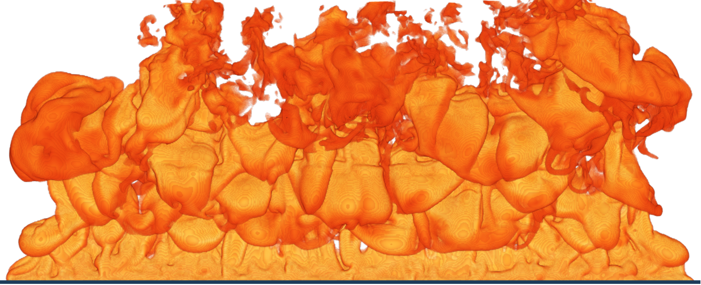
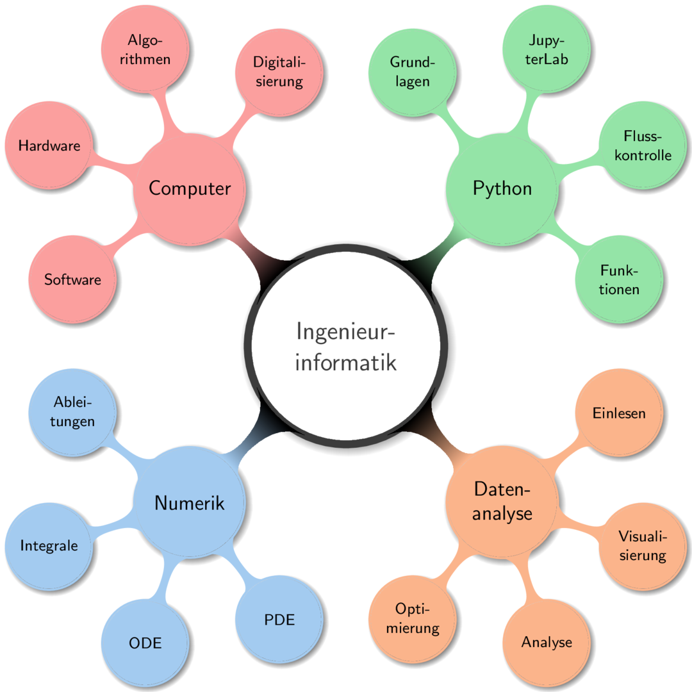

## Allgemeine Infos

Die Vorlesung *Ingenieurinformatik* an der Bergischen Universität Wuppertal wurde vom im Jahr 2019 gebildeten Lehrstuhl [*Computational Civil Engineering (CCE)*](https://cce.uni-wuppertal.de/) übernommen. Der CCE-Lehrstuhl beschäftigt sich hauptsächlich mit der Erforschung und Entwicklung neuer computergestützter Modelle. Im Zentrum der Anwendung steht die numerische Simulation der Brand- und Rauchausbreitung in Gebäuden.  

Dies ist das erste Jahr in dem wir dieses Skript anbieten. Die Motivation zur Erstellung dieses Skriptes ist zum Einen den Teilnehmern der Vorlesung eine Möglichkeit zum Nachlesen der Inhalte zu geben. Und zum Anderen auch Externen bzw. ehemaligen Teilnehmen diese Inhalte frei zur Verfügung zu stellen.

Jedoch, dieses Skript ist sehr kurz gefasst und wird es auch so bleiben. Viele der Inhalte sind in größerer Tiefe bereits frei zugänglich, so dass auf die entsprechenden Stellen verwiesen wird – anstatt diese einfach zu kopieren.  

Da sich das Skript in der Entwicklung befinden freuen wir uns über konstruktive Anregungen und Ihr Feedback. So können Sie Ihre Nachfolger unterstützen.

**Alle organisatorischen Informationen zum Ablauf finden Sie auf der [CCE-Webseite zur Ingenieurinformatik](https://cce.uni-wuppertal.de/index.php?id=4178&L=0).** 

## Inhaltsübersicht

* Geplant ist, dass dieses Skript nicht nur die Vorlesung *Ingenieurinformatik* sondern auch andere mit dieser Vorlesung verknüpfte Inhalte, wie z.B. *Datenanalyse mit Python*, enthält. Im Laufe der Vorlesung werden wir die für Sie relevanten Inhalte entsprechend bekannt geben. Im Sommersemester 2020 werden voraussichtlich aber noch keine weiteren Inhalte eingebunden sein.
* Das Skript enthält auch Übungsaufgaben für alle Kapitel, mit und ohne Lösungswege, aber immer mit einem Ergebnis bzw. der Möglichkeit der Validierung Ihrer Lösung.

## Themenübersicht

## Mitwirkende

An der Ausarbeitung des Skripts und der Übungen sind beteiligt (in alphabetischer Reihenfolge):

* Lukas Arnold
* Alexander Belt
* Max Böhler
* Marc Fehling
* Sven Orzel
* My Linh Würzburger

## Danksagung

Die in der Vorlesung und der Erstellung der Materiallien verwendeten Softwarewerkzeuge sind meist frei verfügbar, quelloffen und von Freiwilligen entwickelt. Insbesondere möchten wir folgenden Teams für ihre Arbeit danken

* Team von [Jupyter](https://github.com/jupyter/jupyter)
* Team von [JupyterLab](https://github.com/jupyterlab)
* Team von [Jupter Book](https://github.com/jupyter/jupyter-book)

## Kontakt

So erreichen Sie uns:
* Als Teilnehmer der Vorlesung: am besten über den zugehörigen [Moodle-Kurs](https://moodle.uni-wuppertal.de/course/view.php?id=20146)
* Externe Interessenten benutzten am besten unsere <a href="mailto:cce-inginf@lists.uni-wuppertal.de">Emailliste</a>
* Kontaktmöglichkeiten zu einzelnen Personen finden Sie auf der [Mitarbeiterwebseite](https://cce.uni-wuppertal.de/index.php?id=4186&L=0) 

## Abschlussarbeiten

Wir bieten Abschlussarbeiten (BA, MA, PhD) zu vielen verschiedenen Themen an 
* eine Themenübersicht und bereits betreuter Arbeiten finden Sie auf der [Abschlussarbeitenwebseite](https://cce.uni-wuppertal.de/index.php?id=4171&L=0)
* Bei der Themenfindung kann auch die [Übersicht unserer Publikationen](https://www.fz-juelich.de/ias/ias-7/EN/AboutUs/Staff/Current/Arnold_Lukas/publication_node.html) helfen 
* Bei Interesse kontaktieren Sie bitte Lukas Arnold

## English Version

Is an english version planned? Not yet, please contact Lukas Arnold.