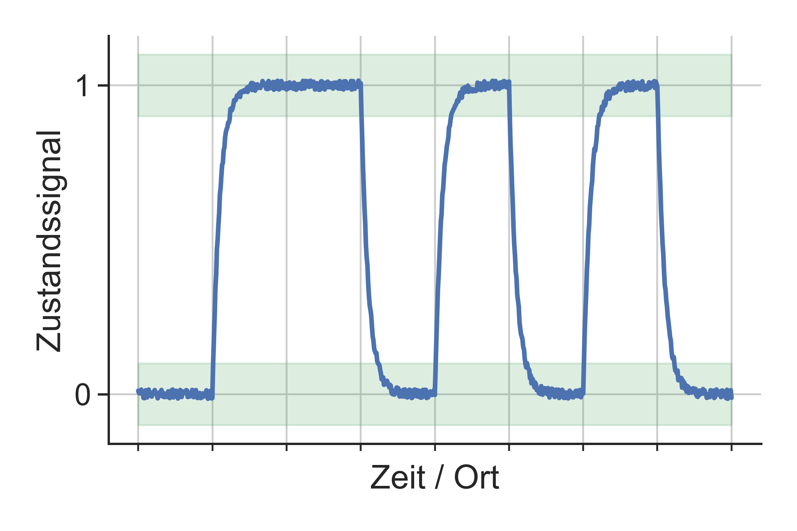
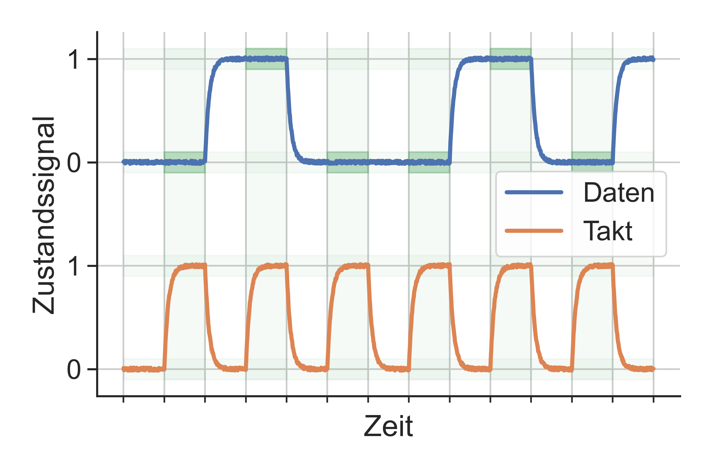
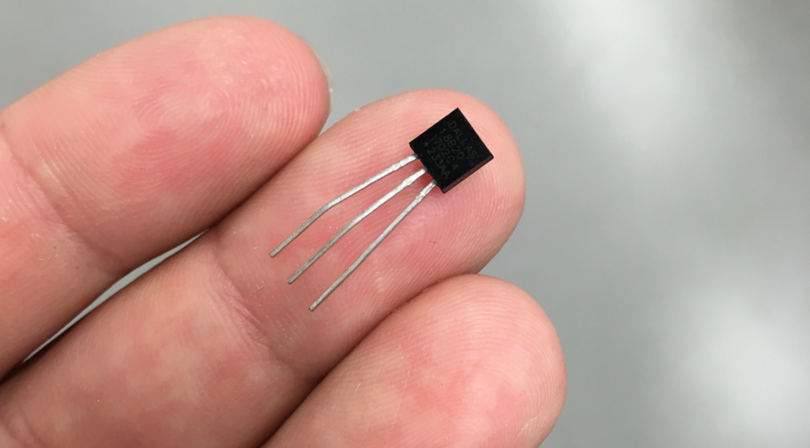

<!---
<h1>Ingenieurinformatik</h1>

<h2>Vorlesung 1.0 – Übersicht Computer</h2>

Lukas Arnold   
Computational Civil Engineering  
Bergische Universtität Wuppertal
--->

---

# Informatik

* Wissenschaft im Kontext von Digitalrechnern
* Vier Disziplinen
 * Technische Informatik
 * Praktische Informatik
 * Angewandte Informatik
 * Theoretische Informatik

---

class: rotate

# Disziplinen der Informatik

---

# Beispiele aus dem Bauingenieurwesen @ BUW

* [Baubetrieb und Bauwirtschaft](https://www.baubetrieb.uni-wuppertal.de)

* [Baumechanik und Numerische Methoden](http://www.baumechanik.uni-wuppertal.de/index.php?content=start)

* [Computersimulation für Brandschutz und Fußgängerverkehr](https://www.asim.uni-wuppertal.de/)

---

# Computational Civil Engineering (CCE)  @ BUW

* Erforschung und Entwicklung neuer computergestützter Modelle
* Brand- und Rauchausbreitung in Gebäuden. 
* Lehre
 * [Ingenieurinformatik](https://cce.uni-wuppertal.de/index.php?id=4178&L=0)
 * [Numerische Brandsimulationen](https://cce.uni-wuppertal.de/index.php?id=4185&L=0)
* Modellierung
 * CFD
 * FDS / ARTSS / PROPTI 
 * JURECA

---

# JURECA @ FZJ

---

class: rotate

# U-Bahnstation

<video controls width="85%"> <source src="https://uni-wuppertal.sciebo.de/s/L8WzAy7adlX45Yk/download" type="video/mp4"> </video>

---

class: rotate

# Flüssigkeitsbrand

<video controls width="85%"> <source src="https://uni-wuppertal.sciebo.de/s/muvLoJ1qgmJgBHT/download" type="video/mp4"> </video>

---

class: rotate

# Brandausbreitung

<video controls width="85%"> <source src="https://uni-wuppertal.sciebo.de/s/mBzgUtDRcZfYJRb/download" type="video/mp4"> </video>

---

# Grundidee eines Computers

1. Digitale Computer unterscheiden nur zwei Zustände
 * an / wahr / 1
 * aus / falsch / 0
 
1. Aufbau nur durch grundlegende Logik-Operationen (Auswahl)
 * AND
 * OR
 * NOT
 
1. Komplexität durch sehr schnelle Datenverarbeitung

---

# Kapitelinhalte

* Digitalisierung

* Algorithmen

* Hardware

* Software

---

class: rotate
# Zustände und Wechsel

---

class: rotate
# Takt

---

# Analoge Signale

* kontinuierlich auf makroskopischer Skala

* alle Werte des Wertebereich können angenommen werden

---

# Analoge Messung – Beispiele

.center.pull-left[

]

.center.pull-right[

]

---

class: rotate

# Temperaturmessung

<video controls height="95%"><source src="https://uni-wuppertal.sciebo.de/s/aPPAWLrOhqHtyy2/download" type="video/mp4"> </video>

---

class: rotate
# Analoges Signal

---

# Digitale Signale

* Nachteil: diskret bzw. quantisiert

* Vorteile 
 * einfache und schnelle Vervielfältigung und Übertragung
 * hohe Flexibilität bei der Speicherung und Darstellung 
 * einfache (Weiter-) Verarbeitung
 * Möglichkeit der Validierung und Verschlüsselung

---

class: rotate
# A-D-Wandler

---

class: rotate
# Beispiel DS18B20

---

# Zusammenfassung
