<center>


<!---
<h1>Ingenieurinformatik</h1>

<h2>Vorlesung 1.0 – Übersicht Computer</h2>

Lukas Arnold <br><br>
Computational Civil Engineering <br>
Bergische Universtität Wuppertal
--->

</center>

---

class: topic

# Algorithmen


---

# Algorithmus

.center[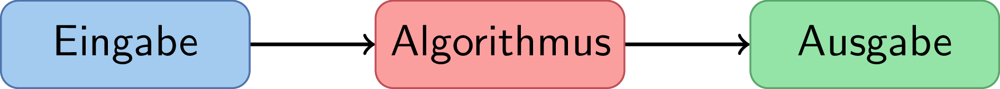]

* formale Vorschrift zur Lösung einer Fragestellung
* Folge von einfachen Anweisungen
* nicht nur für eine einzelne explizite Fragestellung, sondern auch Allgemeinen

---

# Beispiele für manuelle Algorithmen

* Schriftliches Rechnen
* Lösen von linearen Gleichungssystemen
* Bestimmung des Durchschnitts
* Lösen eines Zauberwürfels

---

# Beispiele für computergestützte Algorithmen

* Numerische Lösung von Differentialgleichungen (z.B. Strukturmechanik, Wärmetransport)
* Suchmachinen im Internet
* Vorschläge beim online Einkaufen oder Medienkonsum
* Autonavigation

---

# Maximaler Wert einer Zahlenliste

1. Eingabe: Menge $\sf A$ von $\sf n$ Zahlen, $\sf A=A_0, \dots A_{n-1}$
1. Setzte Hilfswert (Variable) $\sf m$ auf das erste Element der Liste, d.h. $\sf m = A_0$
1. Gehe alle Elemente von $\sf A$ durch, aktuelles Element ist $\sf a$:
	* Falls das aktuelle Element $\sf a$ größer ist als $\sf m$:
		- setzte $\sf m = a$
		- mache weiter mit dem nächsten Element in Schritt 3
	* Falls nicht:
		- mache weiter mit dem nächsten Element in Schritt 3
1. Nach Schritt 3, enthält $\sf m$ den maximalen Wert der Liste $\sf A$


---

class: rotate

# Flussdiagramm

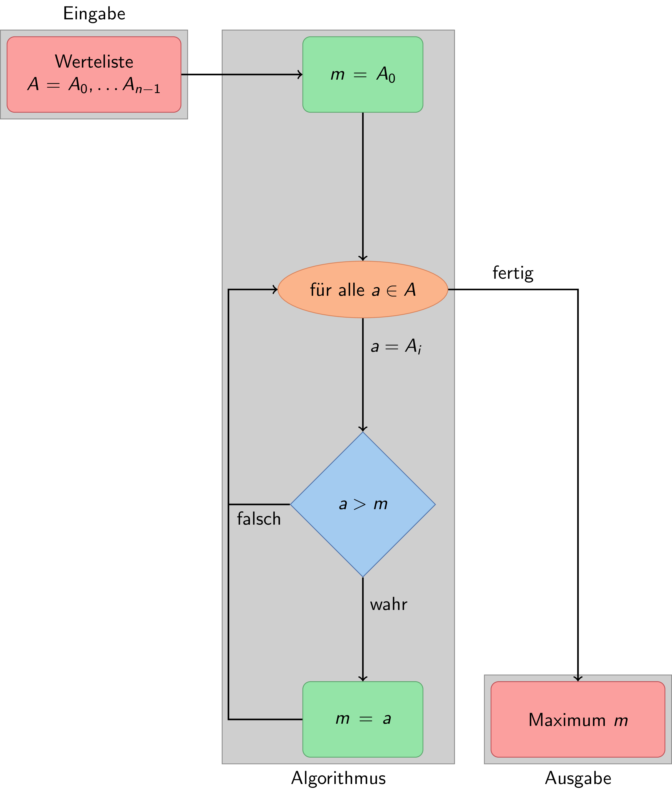

---

# Grundelemente im Flussdiagramm

* **Anweisungen** (grün): Hier finden Zuweisungen, z.B. Setzen von Variablenwerten, hier $\sf m$, statt
* **Schleifen** (orange): Wiederholungen bzw. Iterationen über eine Menge, dabei wird bei jedem Durchlauf der Wert der Laufvariable, hier $\sf a$, neu gesetzt
* **Verzweigung** (blau): Abfrage einer Bedingung, welche entscheidet welche folgenden Elemente ausgeführt werden, hier wird geprüft ob $\sf a > m$


---

class: rotate

# Schritt 1

```
Schritt 1:
==========
A = [203, 433, 504, 602, 567, 762, 183, 482, 471, 741,
 854, 486, 350, 550, 885, 395, 203, 288, 909, 644]

```

---

class: rotate

# Schritt 2

```
A = [203, 433, 504, 602, 567, 762, 183, 482, 471, 741,
 854, 486, 350, 550, 885, 395, 203, 288, 909, 644]
 

Schritt 2:
==========
m = A[0] = 203
```

---

class: rotate

# Schritt 3

```
A = [203, 433, 504, 602, 567, 762, 183, 482, 471, 741,
 854, 486, 350, 550, 885, 395, 203, 288, 909, 644]
 

Schritt 3:
==========
a = 203, m = 203
a = 433, m = 203, da a > m ist, setzte m auf m= 433
a = 504, m = 433, da a > m ist, setzte m auf m= 504
a = 602, m = 504, da a > m ist, setzte m auf m= 602
a = 567, m = 602
a = 762, m = 602, da a > m ist, setzte m auf m= 762
a = 183, m = 762
a = 482, m = 762
a = 471, m = 762
a = 741, m = 762
[...]
```

---

class: rotate

# Schritt 3

```
A = [203, 433, 504, 602, 567, 762, 183, 482, 471, 741,
 854, 486, 350, 550, 885, 395, 203, 288, 909, 644]
 

Schritt 3:
==========
[...]
a = 854, m = 762, da a > m ist, setzte m auf m= 854
a = 486, m = 854
a = 350, m = 854
a = 550, m = 854
a = 885, m = 854, da a > m ist, setzte m auf m= 885
a = 395, m = 885
a = 203, m = 885
a = 288, m = 885
a = 909, m = 885, da a > m ist, setzte m auf m= 909
a = 644, m = 909
```

---

class: rotate

# Schritt 4

```
A = [203, 433, 504, 602, 567, 762, 183, 482, 471, 741,
 854, 486, 350, 550, 885, 395, 203, 288, 909, 644]
 

Schritt 4:
==========
Maximaler Wert in A: m = 909
```

---

class: topic

# Suchalgorithmen


---

# Suchalgorithmen

* **Problemstellung** Eine Liste von Zahlen soll der Größe nach sortiert werden 

* **Ansatz** Möglichst wenige Operationen durchführen

* **Anwendung** Datenbanken und Suchvorgänge

---

# Grundidee Selection Sort

1. es wird das kleinste Element der Liste gesucht
1. dieses wird mit dem ersten Element getauscht
1. nun wird das zweit-kleinste Element gesucht, jedoch ohne das erste Element zu berücksichtigen
1. diese wird mit dem zweiten Element getauscht
1. die obigen beiden Schritte werden wiederholt, bis nur noch ein Element in der zu durchsuchenden Liste steht

---

class: rotate

# Selection Sort

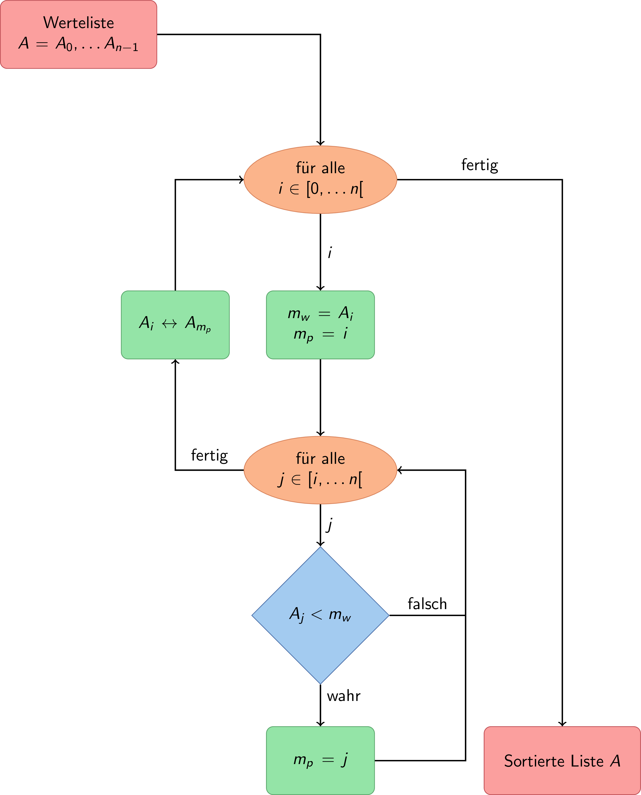

---

class: rotate

# Beispiel Selection Sort

```
Zu sortierende Werteliste  [42, 6, 22, 11, 54, 12, 31]

```
--
```
Iteration  1: 
   Minimum von  [42, 6, 22, 11, 54, 12, 31] ist 6
   Sortierter / Unsortierter Teil:  [6] / [42, 22, 11, 54, 12, 31]
```
--
```
Iteration  2: 
   Minimum von  [42, 22, 11, 54, 12, 31] ist 11
   Sortierter / Unsortierter Teil:  [6, 11] / [22, 42, 54, 12, 31]
```
--
```
Iteration  3: 
   Minimum von  [22, 42, 54, 12, 31] ist 12
   Sortierter / Unsortierter Teil:  [6, 11, 12] / [42, 54, 22, 31]
```
--
```
Iteration  4: 
   Minimum von  [42, 54, 22, 31] ist 22
   Sortierter / Unsortierter Teil:  [6, 11, 12, 22] / [54, 42, 31]
```
---

class: rotate

# Selection Sort

```
Zu sortierende Werteliste  [42, 6, 22, 11, 54, 12, 31]

```

```
Iteration  4: 
   Minimum von  [42, 54, 22, 31] ist 22
   Sortierter / Unsortierter Teil:  [6, 11, 12, 22] / [54, 42, 31]
```
--
```
Iteration  5: 
   Minimum von  [54, 42, 31] ist 31
   Sortierter / Unsortierter Teil:  [6, 11, 12, 22, 31] / [42, 54]
```
--
```
Iteration  6: 
   Minimum von  [42, 54] ist 42
   Sortierter / Unsortierter Teil:  [6, 11, 12, 22, 31, 42] / [54]
```
--
```
Iteration  7: 
   Minimum von  [54] ist 54
   Sortierter / Unsortierter Teil:  [6, 11, 12, 22, 31, 42, 54] / []
```

---

# Grundidee Bubble Sort

1. es wird die Liste von hinten nach vorn durchlaufen
1. benachbarte Elemente werden vertauscht, wenn das rechte Element kleiner ist als das linke
1. beim nächsten Durchlauf wird eine kürzere Liste durchlaufen, d.h. ohne die bereits sortierten Elemente
1. obiger Schritt wird wiederholt bis keine Vertauschung mehr stattfand

---
class: rotate

# Flussdiagramm Bubble Sort


---

class: rotate

# Beispiel Bubble Sort

```
Zu sortierende Werteliste  [42, 6, 22, 11, 54, 12, 31]

```
```
Iteration  1: 
   Liste:  [42, 6, 22, 11, 54, 12, 31]
   Tausche:  42 und 6
   Liste:  [6, 42, 22, 11, 54, 12, 31]
   Tausche:  42 und 22
   Liste:  [6, 22, 42, 11, 54, 12, 31]
   Tausche:  42 und 11
   Liste:  [6, 22, 11, 42, 54, 12, 31]
   Tausche:  54 und 12
   Liste:  [6, 22, 11, 42, 12, 54, 31]
   Tausche:  54 und 31
   Liste:  [6, 22, 11, 42, 12, 31, 54]
```

---

class: rotate

# Beispiel Bubble Sort

```
Zu sortierende Werteliste  [42, 6, 22, 11, 54, 12, 31]

```
```
Iteration  2: 
   Liste:  [6, 22, 11, 42, 12, 31, 54]
   Tausche:  22 und 11
   Liste:  [6, 11, 22, 42, 12, 31, 54]
   Tausche:  42 und 12
   Liste:  [6, 11, 22, 12, 42, 31, 54]
   Tausche:  42 und 31
   Liste:  [6, 11, 22, 12, 31, 42, 54]
```

---

class: rotate

# Beispiel Bubble Sort

```
Zu sortierende Werteliste  [42, 6, 22, 11, 54, 12, 31]

```
```
Iteration  3: 
   Liste:  [6, 11, 22, 12, 31, 42, 54]
   Tausche:  22 und 12
   Liste:  [6, 11, 12, 22, 31, 42, 54]

Iteration  4: 
   Liste:  [6, 11, 12, 22, 31, 42, 54]
   kein Tausch mehr notwendig
```

---

class: topic

# Eigenschaften von Algorithmen

---

# Eigenschaften von Algorithmen

* Terminiertheit
* Determiniertheit
* Effizienz
* Komplexität

---

# Terminiertheit

* Algorithmus hält nach endlich vielen Schritten an

* nicht immer beweisbar, z.B. Collatz-Problem:
 * beginne mit irgendeiner natürlichen Zahl $\sf n_0 > 0$
 * ist $\sf n_i$ gerade so ist $\sf n_{i+1} = n_i/2$
 * ist $\sf n_i$ ungerade so ist $\sf n_{i+1} = 3n_i + 1$
 * endet bei $\sf n_i = 1$
 
* Vermutung: Jede so konstruierte Zahlenfolge mündet in den Zyklus 4, 2, 1
* Bisher unbewiesen

* Beispielfolge: 15, 46, 23, 70, 35, 106, 53, 160, 80, 40, 20, 10, 5, 16, 8, 4, 2, 1

---

# Determiniertheit

* es treten nur definierte und reproduzierbare Zustände auf

* die Ergebnisse sind immer reproduzierbar

* Beispiele:
 * Addition ganzer Zahlen
 * Selection Sort
 * Collatz-Sequenz

---

# Effizienz

Die Effizienz ist nicht strikt definiert und kann umfassen: 
* Laufzeit
* Speicheraufwand
* Energieverbrauch

Bei bestimmten Anwendungen sind entsprechende Eigenschaften notwendig:
* Speicheraufwand bei Big Data, z.B. in der Bioinformatik
* Laufzeit bei Echtzeitanwendung, z.B. Flugzeugsteuerung, Fußgängerdynamik

---

# Komplexität

* Maß für den asymptotischen Aufwand  

* gesucht ist die Aufwandfunktion $\sf f(n)$, welche von der Problemgröße $\sf n$ abhängt

* Beispiele für eine Problemgröße:
 * Anzahl der Summanden bei einer Summe 
 * Anzahl der zu sortierenden Zahlen

---

# Komplexität

* meist wird eine einfache Vergleichsfunktion $\sf g(n)$ mit $\sf n \rightarrow \infty$ gesucht

* $\sf g(n)$ beschreibt das asymtotische Wachstum von $\sf f(n)$

* Beispiele:
 * $\sf f_1(n) = n^4 + 5n^2 - 10 \approx \mathcal{O}(n^4) = g_1(n)$ 
 * $\sf f_2(n) = 2^{n+1} \approx \mathcal{O}(2^n) = g_2(n)$ 

---
class: rotate

# Komplexität

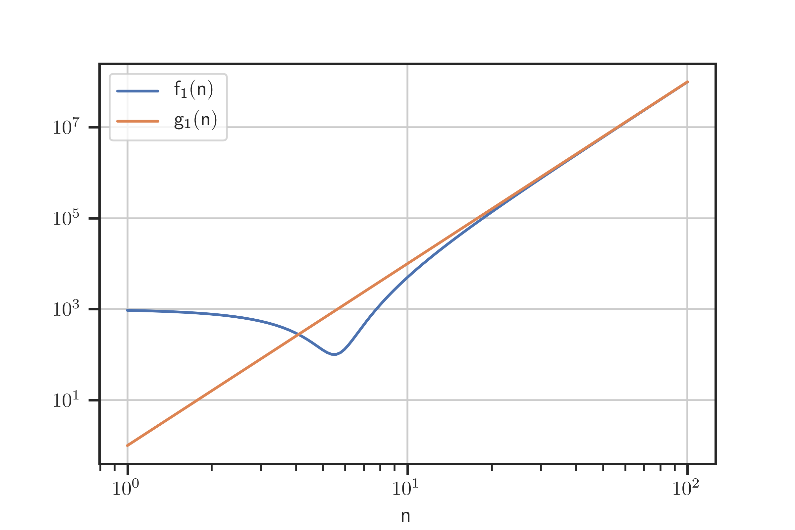

---

# Auswirkungen Komplexität

Beispiel:
* ein Berechnungsschritt sei z.B. 1 s lang
* das $\sf n$ sei beispielsweise 1000

Asymptotische Abschätzungen der Laufzeit:
* $\sf \mathcal{O}(n)$: 10<sup>3</sup> s ≈ 1 h 
* $\sf \mathcal{O}(n^2)$: 10<sup>6</sup> s ≈ 11 d 
* $\sf \mathcal{O}(n^3)$: 10<sup>9</sup> s ≈ 31 a 
* $\sf \mathcal{O}(2^n)$: 2<sup>1000</sup> s ≈ ...

---

# Komplexität Selection Sort

$$ \sf f(n) = \sum_{i=0}^n i = \frac{n(n-1)}{2} \approx \mathcal{O}(n^2) $$

---

class: rotate

# Komplexität Selection Sort

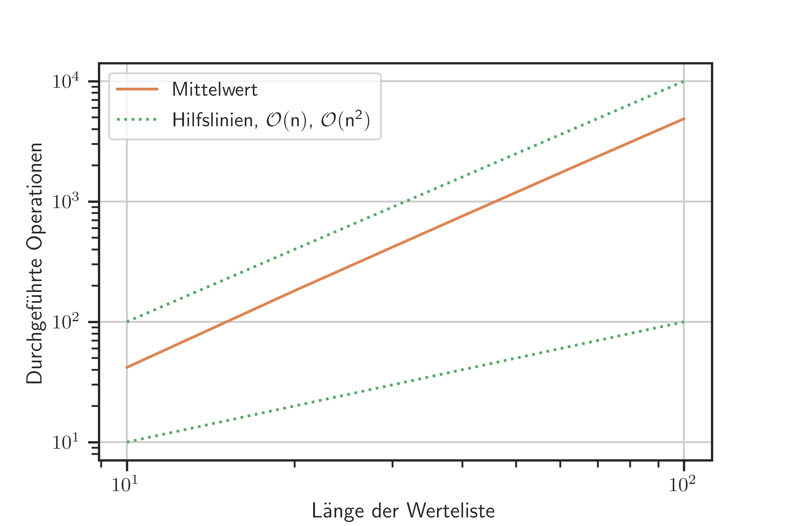

---

# Komplexität Bubble Sort

* best case: $\sf \mathcal{O}(n)$
* worst case: $\sf \mathcal{O}(n^2)$ 
* average case: $\sf \mathcal{O}(n^2)$

---

class: rotate

# Komplexität Bubble Sort – Unsortiert

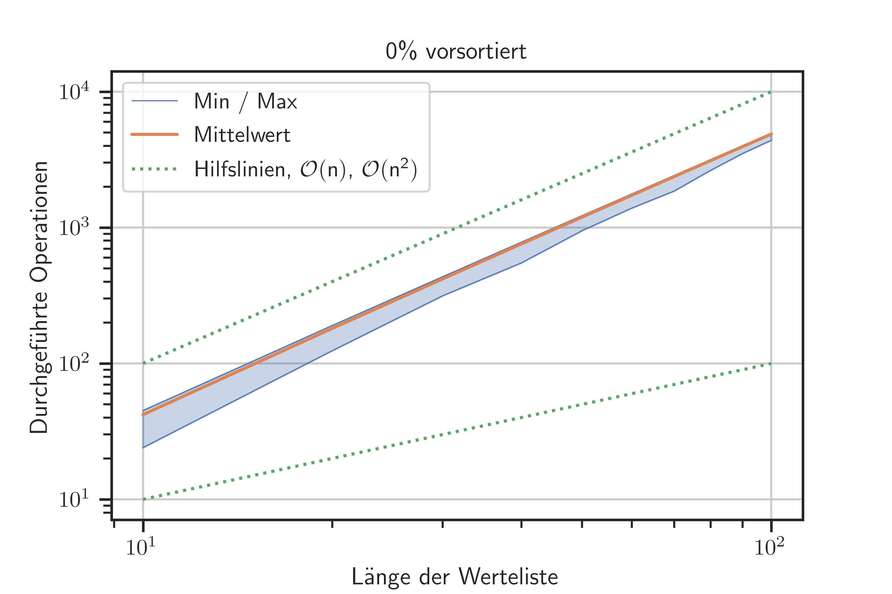

---

class: rotate

# Komplexität Bubble Sort – Vorsortiert

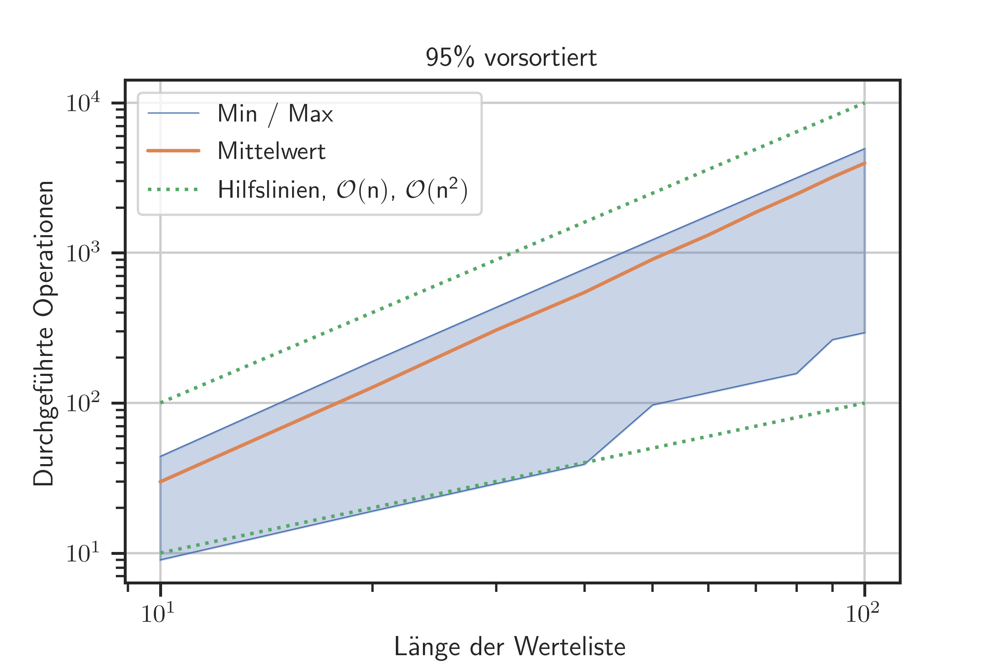

---

class: topic

# Numerische Algorithmen


---

# Newton-Raphson-Verfahren

Das Finden von Nullstellen ist die Grundlage für viele Verfahren, z.B.:
* das Lösen von nicht-linearen Gleichungen, 
* das Finden von Extremwerten, oder
* Optimierungsverfahren

---

# Grundidee 

* iterativen Suche der Nullstelle $\sf x_{ns}$ einer Funktion $\sf f(x)$ 
* Auswertung der ersten Ableitung $\sf f'(x)$
* Näherung der Nullstelle $\sf x_i$ durch Iterationvsvorschrift mit vorgegebenen Startwert, $\sf x_0$ 

$$\sf x_{i+1} = x_i - \frac{f(x_i)}{f'(x_i)} $$

---

# Beispiel 1

* Funktion: $\sf f(x) = 1 - x^2$

* Ableitung: $\sf f'(x) = -2x$ 

* bekannte Nullstellen: $\sf x_{ns} = \{-1, 1\}$

* Startwert: $\sf x_0 = 0.3$

---

class: rotate

# Beispiel 1

```
Startwert x_0 = 0.3000

Iterationsschritt i =  1, x_i = 0.3000
   f(x_i)  = -0.9100
   fp(x_i) = 0.6000
   x_(i+1) = 1.8167

Iterationsschritt i =  2, x_i = 1.8167
   f(x_i)  = 2.3003
   fp(x_i) = 3.6333
   x_(i+1) = 1.1836
```

---

class: rotate

# Beispiel 1

```
Iterationsschritt i =  3, x_i = 1.1836
   f(x_i)  = 0.4008
   fp(x_i) = 2.3671
   x_(i+1) = 1.0142

Iterationsschritt i =  4, x_i = 1.0142
   f(x_i)  = 0.0287
   fp(x_i) = 2.0285
   x_(i+1) = 1.0001
```

---

class: rotate

# Beispiel 1 – Iterationsschritt 0

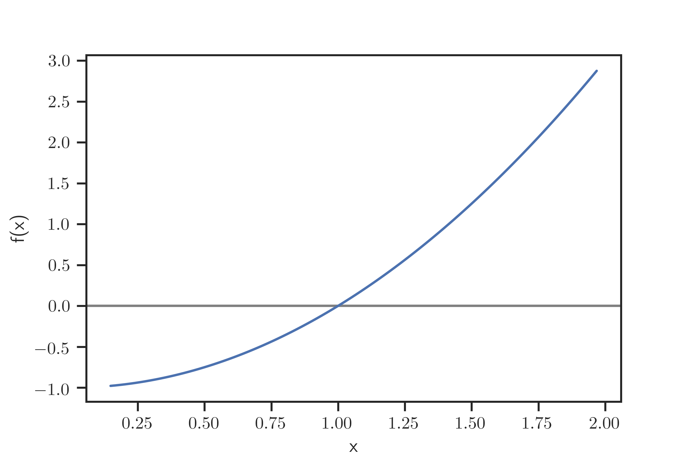

---

class: rotate

# Beispiel 1 – Iterationsschritt 1

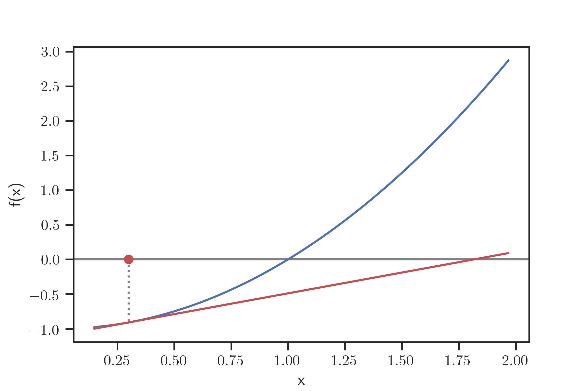

---

class: rotate

# Beispiel 1 – Iterationsschritt 2


---

class: rotate

# Beispiel 1 – Iterationsschritt 3

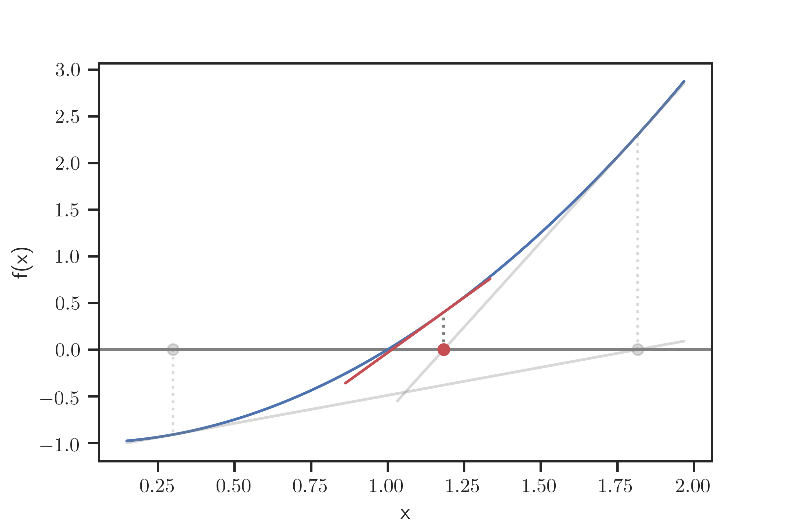

---

# Beispiel 2

* Funktion: $\sf f(x) = \sin(x) - 0.5$

* Ableitung: $\sf f'(x) = \cos(x)$

* Startwert: $\sf x_0 = 1.3$

---

class: rotate

# Beispiel 1

```
Startwert x_0 = 1.3000

Iterationsschritt i =  1, x_i = 1.3000
   f(x_i)  = 0.4636
   fp(x_i) = 0.2675
   x_(i+1) = -0.4329

Iterationsschritt i =  2, x_i = -0.4329
   f(x_i)  = -0.9195
   fp(x_i) = 0.9077
   x_(i+1) = 0.5801
```

---

class: rotate

# Beispiel 1

```
Iterationsschritt i =  3, x_i = 0.5801
   f(x_i)  = 0.0481
   fp(x_i) = 0.8364
   x_(i+1) = 0.5226

Iterationsschritt i =  4, x_i = 0.5226
   f(x_i)  = -0.0009
   fp(x_i) = 0.8665
   x_(i+1) = 0.5236
```

---

class: rotate

# Beispiel 2 – Iterationsschritt 0

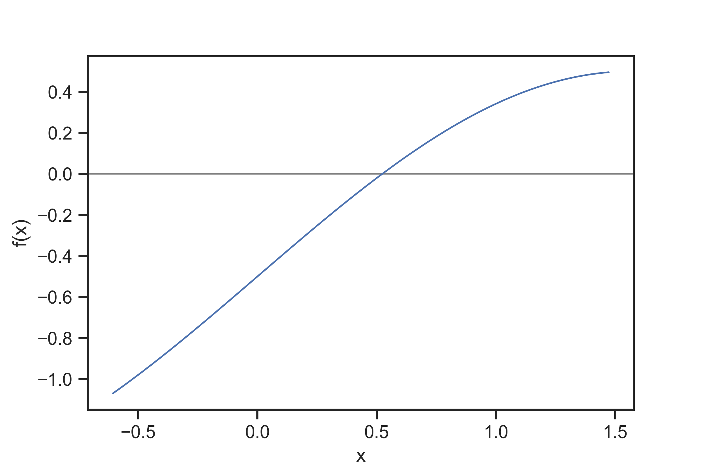

---

class: rotate

# Beispiel 2 – Iterationsschritt 1

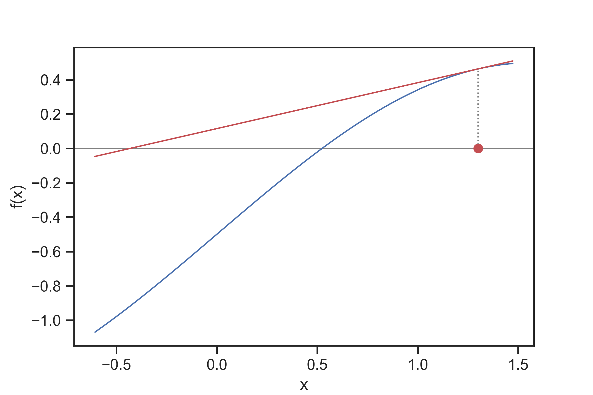

---

class: rotate

# Beispiel 2 – Iterationsschritt 2

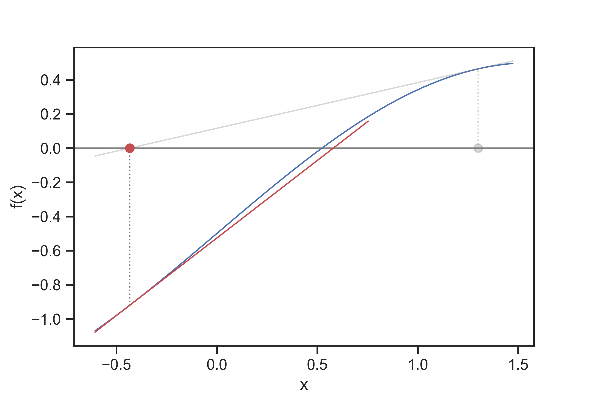

---

class: rotate

# Beispiel 2 – Iterationsschritt 3

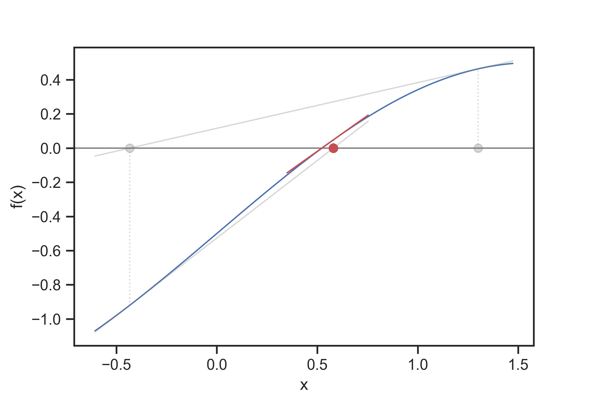

---

# Zusammenfassung

* Algorithmen sind die Grundlage zur computergestützten Lösung von Problemen 

* Viele verschiedene Algorithmen für die gleiche Lösung

* Numerische Verfahren sind insbesondere für Ingenieure und Naturwissenschaftler wichtig