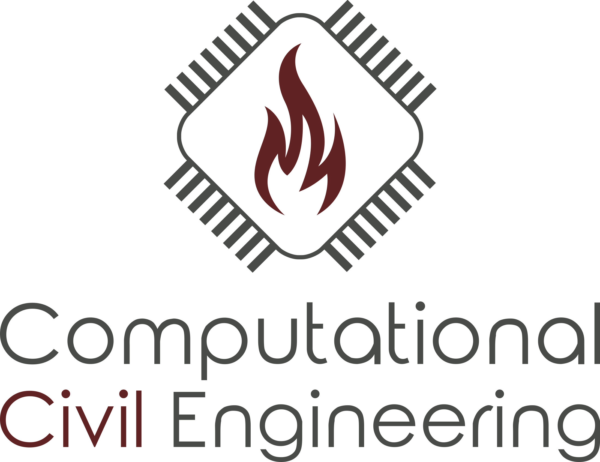
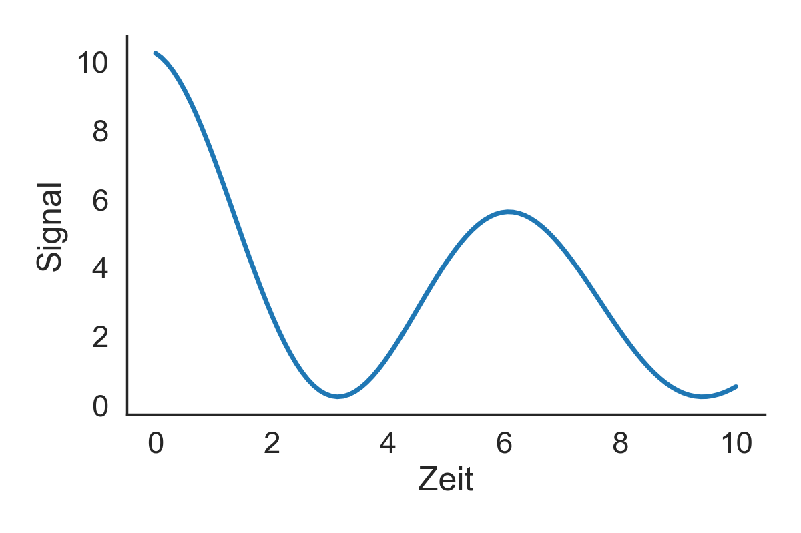
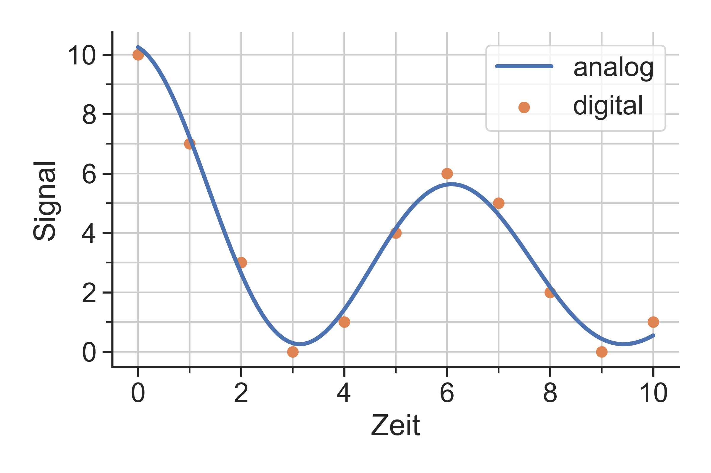
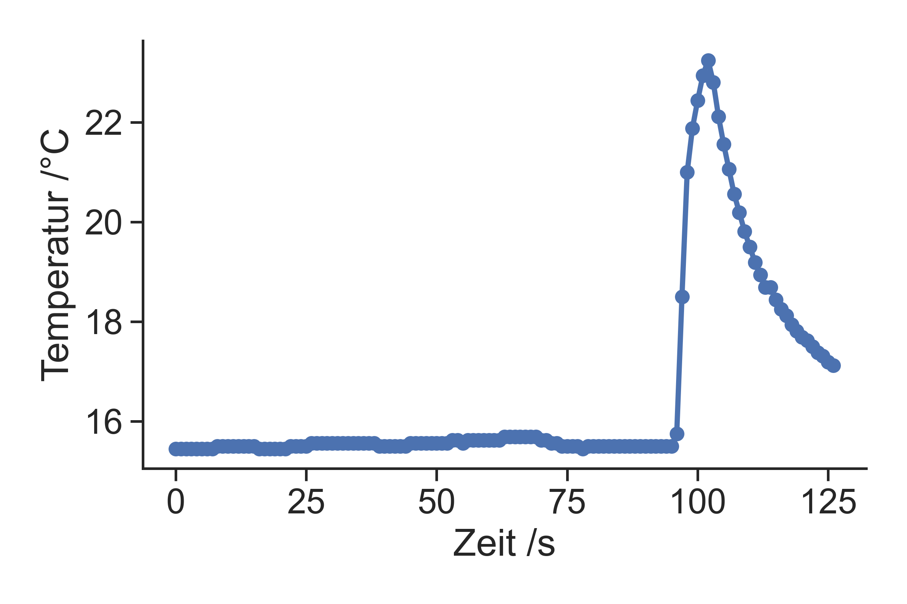
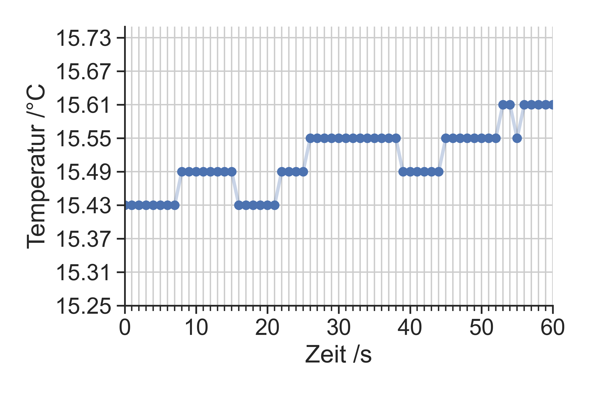

<center>


<!---
<h1>Ingenieurinformatik</h1>

<h2>Vorlesung 1.0 – Übersicht Computer</h2>

Lukas Arnold <br><br>
Computational Civil Engineering <br>
Bergische Universtität Wuppertal
--->

</center>

---

class: topic

# Algorithmen


---

# Algorithmus

.center[]

* formale Vorschrift zur Lösung einer Fragestellung
* Folge von einfachen Anweisungen
* nicht nur für eine einzelne explizite Fragestellung, sondern auch Allgemeinen

---

# Beispiele für manuelle Algorithmen

* Schriftliches Rechnen
* Lösen von linearen Gleichungssystemen
* Bestimmung des Durchschnitts
* Lösen eines Zauberwürfels

---

# Beispiele für computergestützte Algorithmen

* Numerische Lösung von Differentialgleichungen (z.B. Strukturmechanik, Wärmetransport)
* Suchmachinen im Internet
* Vorschläge beim online Einkaufen oder Medienkonsum
* Autonavigation

---

class: rotate

# Disziplinen der Informatik

<center>

</center>

---

# Beispiele aus dem Bauingenieurwesen @ BUW

* [Baubetrieb und Bauwirtschaft](https://www.baubetrieb.uni-wuppertal.de)

* [Baumechanik und Numerische Methoden](http://www.baumechanik.uni-wuppertal.de/index.php?content=start)

* [Computersimulation für Brandschutz und Fußgängerverkehr](https://www.asim.uni-wuppertal.de/)

---

# Computational Civil Engineering (CCE) <br>@ BUW

* Erforschung und Entwicklung neuer computergestützter Modelle
* Brand- und Rauchausbreitung in Gebäuden. 
* Lehre
 * [Ingenieurinformatik](https://cce.uni-wuppertal.de/index.php?id=4178&L=0)
 * [Numerische Brandsimulationen](https://cce.uni-wuppertal.de/index.php?id=4185&L=0)
* Modellierung
 * CFD
 * FDS / ARTSS / PROPTI 
 * JURECA

---

# JURECA @ FZJ


---

class: rotate

# U-Bahnstation

<video controls width="85%"> <source src="https://uni-wuppertal.sciebo.de/s/L8WzAy7adlX45Yk/download" type="video/mp4"> </video>

---

class: rotate

# Flüssigkeitsbrand

<video controls width="85%"> <source src="https://uni-wuppertal.sciebo.de/s/muvLoJ1qgmJgBHT/download" type="video/mp4"> </video>

---

class: rotate

# Brandausbreitung

<video controls width="85%"> <source src="https://uni-wuppertal.sciebo.de/s/mBzgUtDRcZfYJRb/download" type="video/mp4"> </video>

---

class: topic

# Computer

---

# Grundidee eines Computers

1. Digitale Computer unterscheiden nur zwei Zustände
 * an / wahr / 1
 * aus / falsch / 0
 
1. Aufbau nur durch grundlegende Logik-Operationen (Auswahl)
 * AND
 * OR
 * NOT
 
1. Komplexität durch sehr schnelle Datenverarbeitung

---

# Kapitelinhalte

* Digitalisierung

* Algorithmen

* Hardware

* Software

---

class: topic

# Digitalisierung

---

class: rotate
# Zustände und Wechsel

<center>

</center>

---

class: rotate
# Takt

<center>

</center>

---

class: topic

# Analoge Informationen

---

# Analoge Informationen

* kontinuierlich auf makroskopischer Skala

* alle Werte des Wertebereich können angenommen werden

---

# Analoge Messung – Beispiele

.center.pull-left[

]

.center.pull-right[

]

---

class: rotate

# Temperaturmessung

<video controls height="95%"><source src="https://uni-wuppertal.sciebo.de/s/aPPAWLrOhqHtyy2/download" type="video/mp4"> </video>

---

class: rotate
# Analoges Signal

<center>

</center>

---

class: topic

# Digitale Informationen

---

# Digitale Informationen

* Nachteil: diskret bzw. quantisiert

* Vorteile 
 * einfache und schnelle Vervielfältigung und Übertragung
 * hohe Flexibilität bei der Speicherung und Darstellung 
 * einfache (Weiter-) Verarbeitung
 * Möglichkeit der Validierung und Verschlüsselung

---

class: rotate
# A-D-Wandler

<center>

</center>

---

class: rotate
# Beispiel DS18B20


---

class: rotate
# Temperaturmessung



---

class: rotate
# Temperaturmessung – Zoom



---

class: topic

# Digitale Zahlendarstellung

---

# Dualsystem

* 5<sub>10</sub> = 101<sub>2</sub>
* 107<sub>10</sub> = 1101011<sub>2</sub>
* 2635<sub>10</sub> = 101001001011<sub>2</sub>

---

# Hexadezimalsystem

* Neue Ziffern:
 * '10' dargestellt durch `A`
 * bis '15' dargestellt mit `F`

* Beispiele:
 * 5<sub>10</sub> = 5<sub>16</sub> = 0x5
 * 107<sub>10</sub> = 6B<sub>16</sub> = 0x6B
 * 2635<sub>10</sub> = A4B<sub>16</sub> = 0xA4B

---

# Binäre Maßeinheiten

* 1 Bit = eine Ziffer im Binärsystem, Wertebereich: 0 und 1
* 1 Byte = acht Ziffern im Binärsystem, Wertebereich: 0 bis 255


* 1 KB = 1 kiloByte = 10<sup>3</sup> Byte
* 1 MB = 1 megaByte = 10<sup>6</sup> Byte
* 1 GB = 1 gigaByte = 10<sup>9</sup> Byte
* 1 TB = 1 teraByte = 10<sup>12</sup> Byte
* 1 PB = 1 petaByte = 10<sup>15</sup> Byte

---

# Geschwidigkeit der Datenübertragung

* Lesen / Schreiben HDD: ~200 MB/s 
* Lesen / Schreiben SSD: ~500 MB/s


* über das Mobilfunknetz, z.B. [3G](https://de.wikipedia.org/wiki/Mobilfunkstandard): 384 kbit/s
* über ein Netzwerkkabel, z.B. [Fast Ethernet](https://de.wikipedia.org/wiki/Ethernet): ~100 Mbit/s

---

# Darstellung ganzer Zahlen

.center[]


* kleinste Zahl: 0<sub>2</sub> = 0
* größte Zahl: 11111111<sub>2</sub> = 2<sup>8</sup>-1 = 255

---

# Darstellung ganzer Zahlen – Beispiele

.center[]

.center[]

---

# Ganze Zahlen mit Vorzeichen

.center[]

* kleinste Zahl = -2<sup>31</sup> = -2,147,483,648
* größte Zahl =  2<sup>31</sup> - 1 = 2,147,483,647

---

# Darstellung reeller Zahlen

* Näherung durch Gleitkommazahlen
* Aufteilung der Bits:
 * Vorzeichen $\sf s$ 
 * Exponent $\sf e$
 * Mantisse $\sf m$

* Darstellungsgleichung
$$ \sf z = (-1)^s \cdot m \cdot 2^e $$

---

# 64-Bit Gleitkommazahlen

Darstellung mit dem [IEEE754 Standard](https://de.wikipedia.org/wiki/IEEE_754)

.center[]

* Vorzeichen (1 bit)
* Exponent (11 bit)
* Mantisse (52 bit)

---
# 64-Bit Gleitkommazahlen – Wertebereich

Für den Exponenten $\sf e$ gilt

* kleinster Wert in Etwa: -(2<sup>10</sup> - 1) = -1023
* größter Wert in Etwa: ~ 2<sup>10</sup> - 1 = 1023

und somit

* kleinste Größenordnung: 2<sup>-1023</sup> ~ 10<sup>-308</sup>
* größte Größenordnung: 2<sup>1023</sup> ~ 10<sup>308</sup>

---

# 64-Bit Gleitkommazahlen – Genauigkeit

* kleinster Unterschied zwischen zwei Gleitkommazahlen: 10 / 2<sup>52</sup> ~ 2·10<sup>-15</sup>

* das entspricht etwa der 15-ten Nachkommastelle

---

# Zeichendarstellung

* Speicherung als ganze Zahl

* Zuordnung durch die [ASCII Tabelle](https://de.wikipedia.org/wiki/American_Standard_Code_for_Information_Interchange)

* Druckbare Zeichen:

```
 !"#$%&'()*+,-./0123456789:;<=>?
@ABCDEFGHIJKLMNOPQRSTUVWXYZ[\]^_
`abcdefghijklmnopqrstuvwxyz{|}~
```

---

# Zusammenfassung

* Darstellung von Informationen durch Folgen von Zuständen (0/1)

* Quantelung der Werte bei der Digitalisierung

* Konventionen / Standartd zur Interpretation der Bitfolgen