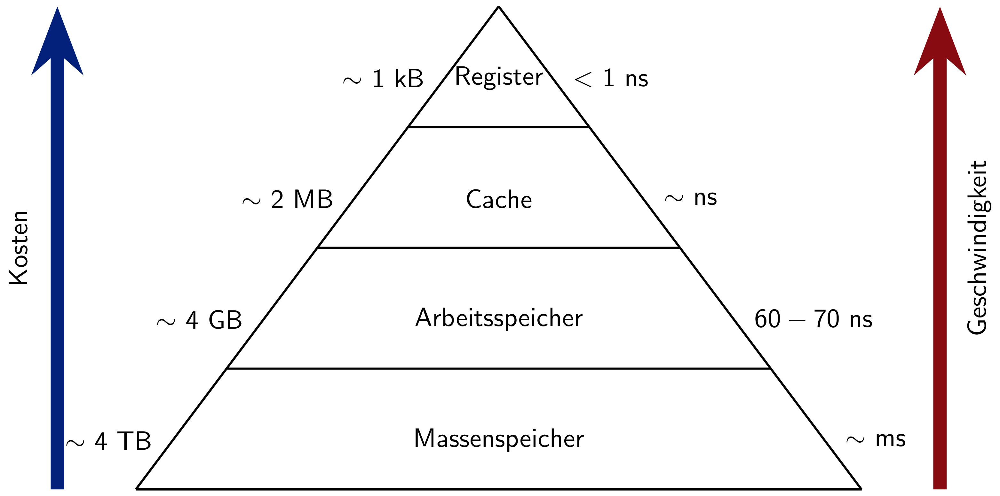
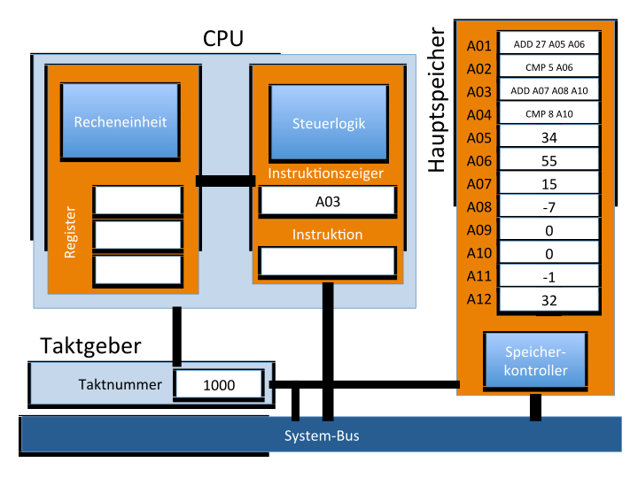
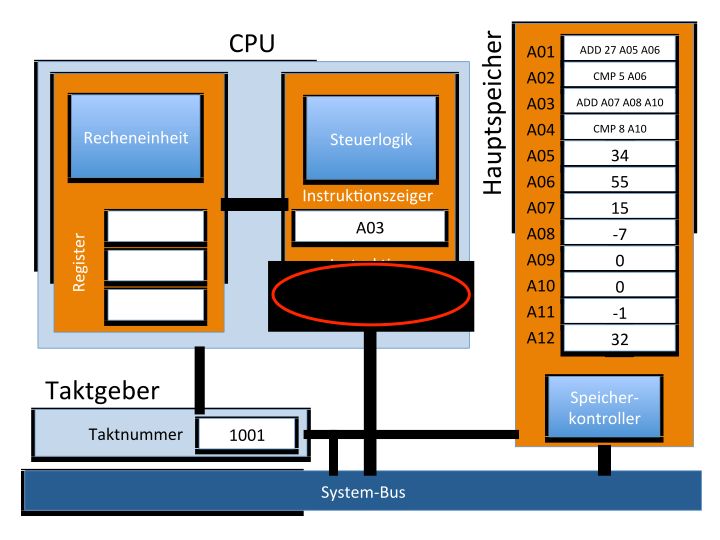
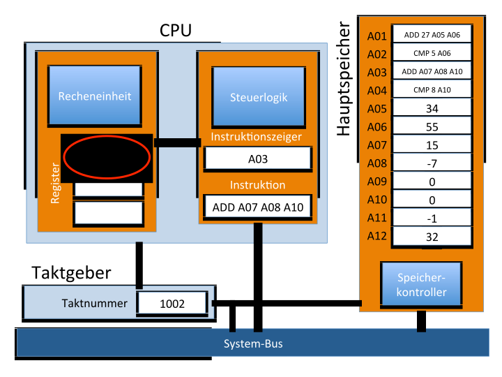
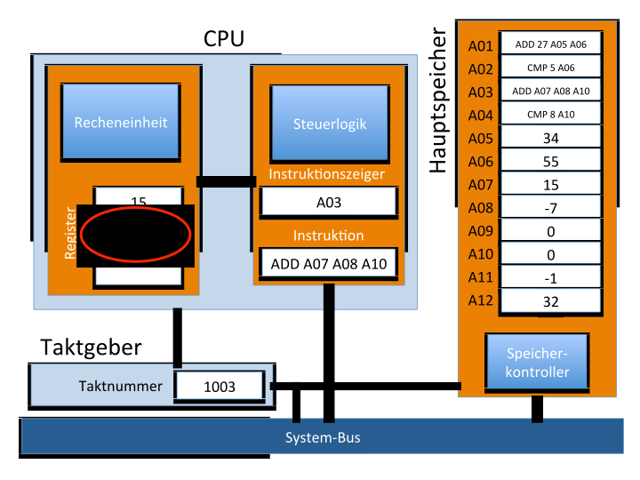
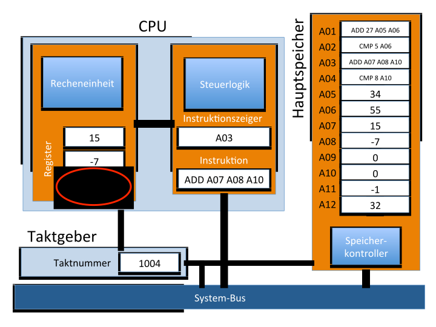
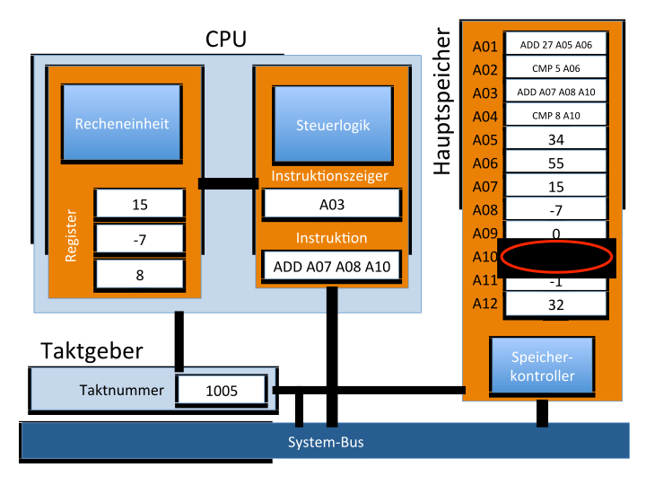
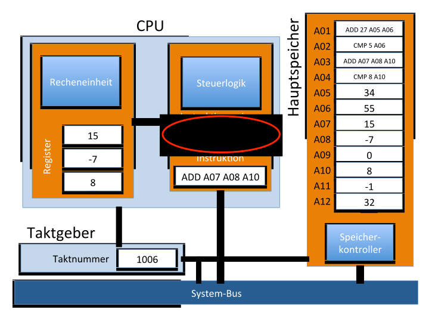

<!---
<h1>Ingenieurinformatik</h1>

<h2>Vorlesung 1.0 – Übersicht Computer</h2>

Lukas Arnold   
Computational Civil Engineering  
Bergische Universtität Wuppertal
--->

---

class: topic

# Computerhardware

---

class: rotate

# Beispiel Computerhardware

---

class: rotate

# Beispiel Computerhardware

 

---

class: rotate

# Beispiel Computerhardware

 

---

class: topic

# Geschichte der Computer

---

# 1936 – Alan Turing

.pull-left[]
.pull-right[]

---

# 1938 – Konrath Zuse

.pull-left[]
.pull-right[]

---

# 1945 – John von Neumann

.pull-left[]
.pull-right[]

---

# 1958 – Jack Kilby

.pull-left[]
.pull-right[]

---

class: rotate

# 1837 – Analytical Engine

---

class: rotate

# 1941 – Zuse Z3

---

class: rotate

# 1976 - Cray 1

---

class: rotate

# 1977 - Apple II

---

class: rotate

# 2020 - Apple MacBook Pro

---

class: rotate

# Hochleistungsrechner – HPC

---

class: topic

# Aufbau eines Computers

---

# Transistoren

.center[]

---

# Logikgatter

|  |  |  |
| :-: | :-: | :-: |
| UND-Gatter | ODER-Gatter | Halbaddierer |
| <table><thead><tr><th>A</th><th>B</th><th>Y</th></tr></thead><tbody><tr><td>0</td><td>0</td><td>0</td></tr><tr><td>1</td><td>0</td><td>0 </td></tr><tr><td>0</td><td>1</td><td>0 </td></tr><tr><td>1</td><td>1</td><td>1</td></tr></tbody></table> | <table><thead><tr><th>A</th><th>B</th><th>Y</th></tr></thead><tbody><tr><td>0</td><td>0</td><td>0</td></tr><tr><td>1</td><td>0</td><td>1 </td></tr><tr><td>0</td><td>1</td><td>1 </td></tr><tr><td>1</td><td>1</td><td>1</td></tr></tbody></table> | <table><thead><tr><th>A</th><th>B</th><th>c </th><th>s</th></tr></thead><tbody><tr><td>0</td><td>0</td><td>0</td><td>0</td></tr><tr><td>1</td><td>0</td><td>0 </td><td>1</td></tr><tr><td>0</td><td>1</td><td>0 </td><td>1</td></tr><tr><td>1</td><td>1</td><td>1</td><td>0</td></tr></tbody></table> |

---

class: rotate

# Mooresches-Gesetz

| Mikrochip | Anzahl der Transistoren | Technologieknoten | Entwicklungsjahr |
| :-: | :-: | :-: | :-: |
| Intel 4004 | 2.300 | 10000 nm  | 1971 |
| Intel Pentium (P5) | 3.100.000 | 800 nm | 1993 |
| Intel Core 2 (Yorkfield) pro Die | 410.000.000 | 45 nm | 2007 |
| Intel Itanium 2 Tukwila | 2.046.000.000 | 65 nm | 2010 |
| AMD Tahiti XT | 4.312.711.873 | 28 nm | 2011 |
| Nvidia Kepler GK110 | 7.100.000.000 | 28 nm | 2012 |
| AMD Epyc - 32 Kern Prozessor | 19.200.000.000 | 14 nm | 2017 | 

---

class: rotate

# Mooresches-Gesetz

---

# Von-Neumann-Architektur

.center[]

---

# x86 Architektur

| Generation | Jahr | Beispiel |
| ---------- | :--: | :------- |
| 1          | 1978 | Intel 8086 |
| 1          | 1982 | Intel 80286 |
| ...        | ...  | ... |
| 8          | 2003 | Athlon 64, Opteron |
| 9          | 2008 | Intel Core i3/i5/i7, AMD Phenom II |

---

# Speichermedien

- **Register**: extrem schneller Speicher auf dem u.A. das Rechenwerk seine Operationen ausführt.
- **Cache**: extrem schneller Zwischenspeicher, um die Zugriffszeit auf den Hauptspeicher zu beschleunigen.
- **Arbeitsspeicher / Hauptspeicher**: Hier werden die meisten Daten und Anweisungen abgespeichert.
- **Massenspeicher – SSD**: Etwas schneller als eine Festplatte, jedoch mit deutlich kürzeren Zugriffszeiten.
- **Massenspeicher – Festplatte**: Langsamster verbauter Speicher, jedoch mit einem sehr großem Volumen.
- **Wechselspeicher – CD-ROM / DVD / BD**: Leicht austauschbare Speicher, im allgemeinen langsam und nur lesbar nutzbar.

---

class: rotate

# Speicherhierarchie

 

---

class: rotate

# AMD Zen Core

---

class: rotate

# AMD Zen Core

---

class: rotate

# AMD Zen CCX

---

class: rotate

# AMD Zen CCX

---

class: rotate

# AMD Zen Zepelin

---

class: rotate

# AMD Zen Zepelin

---

class: rotate

# AMD EPYC

 

---

class: topic

# Arbeitsablauf eines Computers

---

# Arbeitsablauf

- Instruktionen aus dem Speicher laden und interpretieren
- Daten zur Ausführung der Instruktionen laden
- Instruktion ausführen
- Ergebnisse in den Speicher schreiben
- Nächste Instruktion laden

---

class: rotate

# Beispiel Ablauf – Takt 1000

---

class: rotate

# Beispiel Ablauf – Takt 1001

---

class: rotate

# Beispiel Ablauf – Takt 1002

---

class: rotate

# Beispiel Ablauf – Takt 1003

---

class: rotate

# Beispiel Ablauf – Takt 1004

---

class: rotate

# Beispiel Ablauf – Takt 1005

---

class: rotate

# Beispiel Ablauf – Takt 1006

---

class: rotate

# Beispiel Ablauf – Takt 1007

---

# Zusammenfassung

* Computer existieren seit langer Zeit, sind aber seit den letzten Jahrzehnten in unserem Alltag

* Grundbaustein ist der Transformator, welcher zunehmend kompakt hergestellt werden kann

* Viele einfache Arbeitsschritte mit einer sehr hohen Ausführgeschwindigkeit
