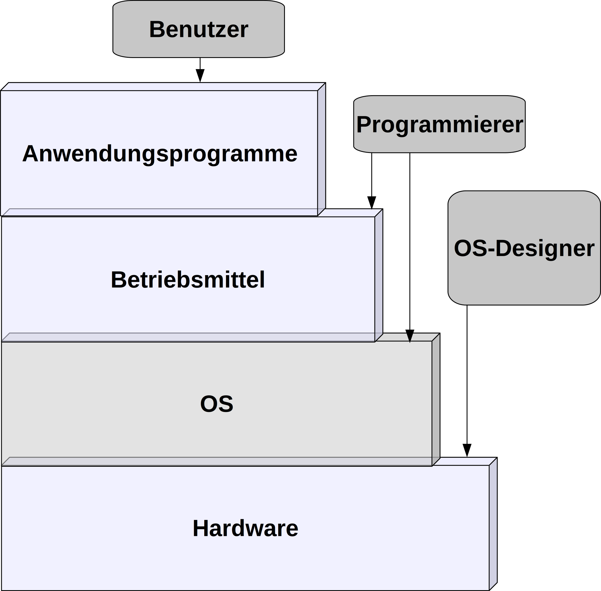
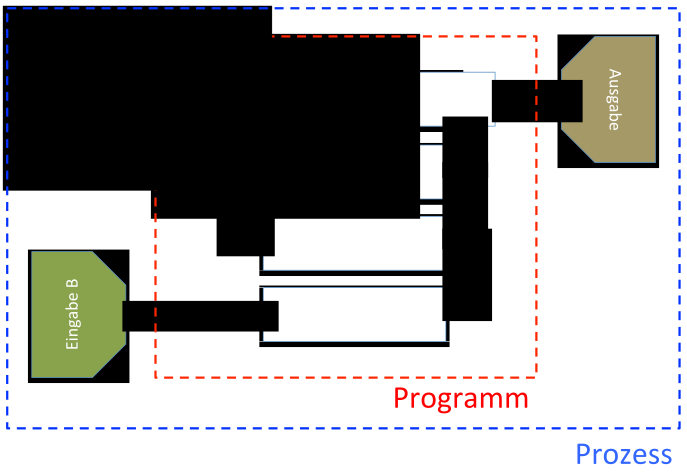
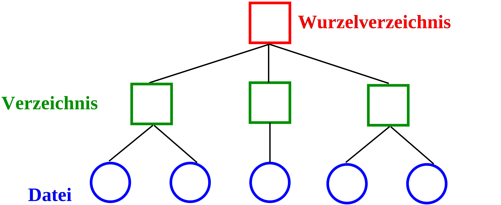
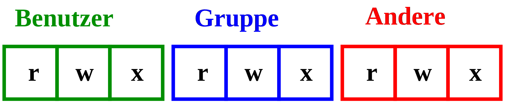

<center>


<!---
<h1>Ingenieurinformatik</h1>

<h2>Vorlesung 1.0 – Übersicht Computer</h2>

Lukas Arnold <br><br>
Computational Civil Engineering <br>
Bergische Universtität Wuppertal
--->

</center>

---

class: topic

# Computersoftware


---

# Software

Erst durch die Software, wird der Computer zu dem Werkzeug, welches wir kennen.

---

# Lizenzen

- frei, wie Freiheit

- frei, wie Freibier

- quelloffen

- proprietär


---

class: topic

# Betriebssystem


---

# Betriebssystem

.pull-left[]

.pull-right[
- Bildschirmausgabe und Tastatureingabe
- Grafische Darstellung der Benutzeroberfläche
- Dateisystem
- Arbeitsspeicher
- Netwerk
]

---

class: rotate

# Abstraktion




---

class: rotate

# Programm, Prozess, Thread



---

# Mehrprozessbetrieb

* mehrere Prozesse gleichzeitig

* Stückchen der verschiedenen Prozesse werden hintereinander ausgeführt

* Beim Wechsel zwischen den Prozessen merkt sich das OS den Status (Register, Speicher) eines Prozesses

---


# Betriebssysteme

| Beispiele Windows-Familie: | Beispiele UNIX- und BSD-Familie: | Beispiel Apple (aufbauend auf BSD): |
| :-- | :-- | :-- |
|  |  |  |
| <ul><li>Windows 10</li><li>Windows 8 (NT 6.2)</li><li>Windows Phone 8 (NT 6.2)</li></ul> | <ul><li>FreeBSD</li><li>AIX</li><li>Linux</li><li>Android</li><li>Firefox OS</li></ul> | <ul><li>OSX 10.14</li><li>iOS 13</li></ul> |


---

class: topic

# Beispiel – Linux

---

class: rotate

# UNIX Geschichte


---

# Philosophie von UNIX

Die UNIX-artigen Betriebssysteme und die dafür entwickelten Anwendungen verfolgen folgende Philosophie:

1. Schreibe Computerprogramme so, dass sie nur eine Aufgabe erledigen und diese gut machen.

1. Schreibe Programme so, dass sie zusammenarbeiten.

1. Schreibe Programme so, dass sie Textströme verarbeiten, denn das ist eine universelle Schnittstelle.

---

# Beispiel – Zusammenarbeit 

- `wc`: zählt z.B. die Anzahl von Zeilen in der Eingabe

- `find`: findet Dateien, z.B. nach Änderungsdatum

- `grep`: sucht nach vorgegebenen Begriffen in der Eingabe

``` bash
find . -mtime -15m -type f | grep -i info | wc -l
```

---

class: topic

# Softwareentwicklung

---

# Erstellen von Software

1. Erstellung des Quellcodes, z.B. mit einem Texteditor

1. Erstellung des Machinencodes, z.B. mit einem Compiler

1. Hinzunahme der vom Betriebssytem und anderen Quellen bereitgestellten Schnittstellen (Bibliotheken) und das Erstellen eines ausführbaren Programms, z.B. mit einem Linker

Hinweis: Python ist eine Skriptsprache

---

# Beispiel – C

Quellcode (in C):
``` C
#include <stdio.h>
int main (int argc, char* argv)
{
  int a = 5;
  int b = a * 2;
  printf ("Der Wert von b lautet: %d\n", b);
}
```

---

# Beispiel – C

Kompilieren mit dem GNU Compiler:
``` bash
gcc -c example.c -o example.o
```

Linken mit dem GNU Compiler:
``` bash
gcc example.o -o example
```

Dateigrößen:

| Quellcode | Compiliertes Objekt | Ausführbares Programm |
| :---------: | :---------: | :-------: |
|    141 B    |    744 B    |   8300 B  |


---

class: topic

# Dateisystem

---

# Motivation

* Daten auch nach dem Abschalten des Computers erhalten

* Organisation der Daten erfolgt in Dateien und Verzeichnissen

---

# Datei

- Dateninhalten: z.B. Messdaten, Texte, Programme. Je nach Datenformat können sie nur von spezieller Software interpretiert werden.

- Attributen: z.B. Dateiname, Dateigröße, Erstellungsdatum, Datum der letzen Änderung, Zugriffsrechte.

---

# Dateitypen

- `.txt`: einfache Textdatei, welche aus ASCII Zeichen besteht und von jedem Texteditor verstanden wird.
- `.py`: Pythonskript, kann mit jedem Texteditor gelesen und verändert werden und von Python interpretiert werden.
- `.mp3`: Audiodatei mit der MPEG Audio Layer III-Kodierung
- `.zip`: ZIP-Archiv, komprimierter Dateikontainer
- `.exe` oder `.app`: Programm für Windows oder OSX

---

# Verzeichnisstruktur

.center[]

---

class: rotate

# OS Verzeichnisstrukturen 


---

# Dateirechte

.center[]

```
> ll python-vorlesung3.pdf
-rw-r--r-- 1 larnold staff 112859 May 5 22:06 python-vorlesung3.pdf
```

---

# Zusammenfassung

* Computer sind Hardware und Software

* Betriebssysteme abstrahieren die Hardware

* Dateisysteme organisieren und speichern langfristig Daten
