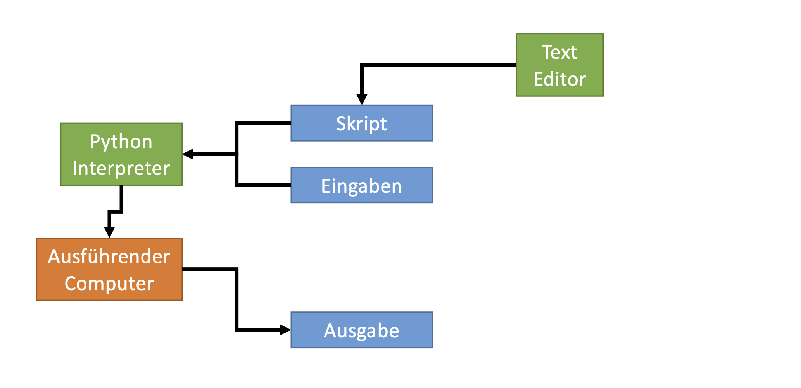
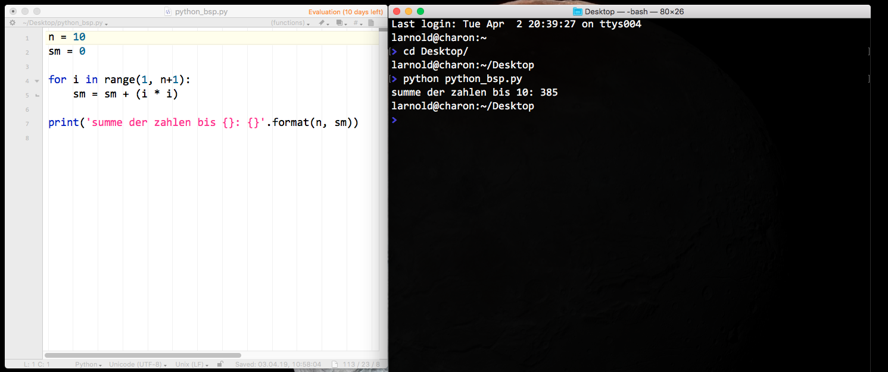
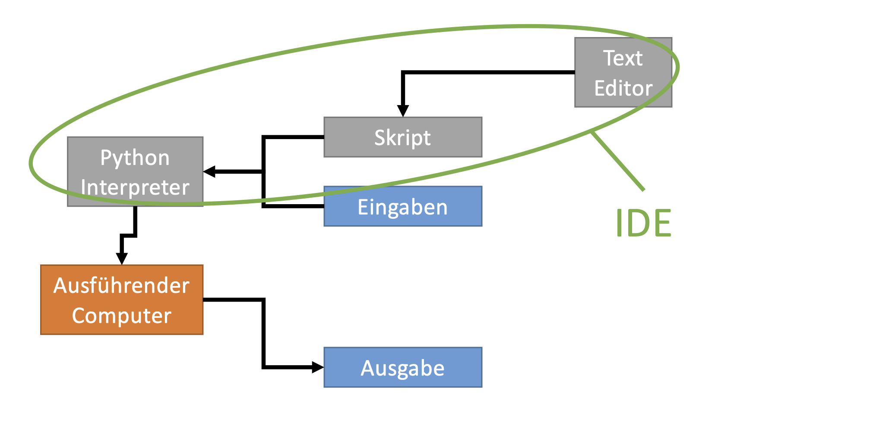
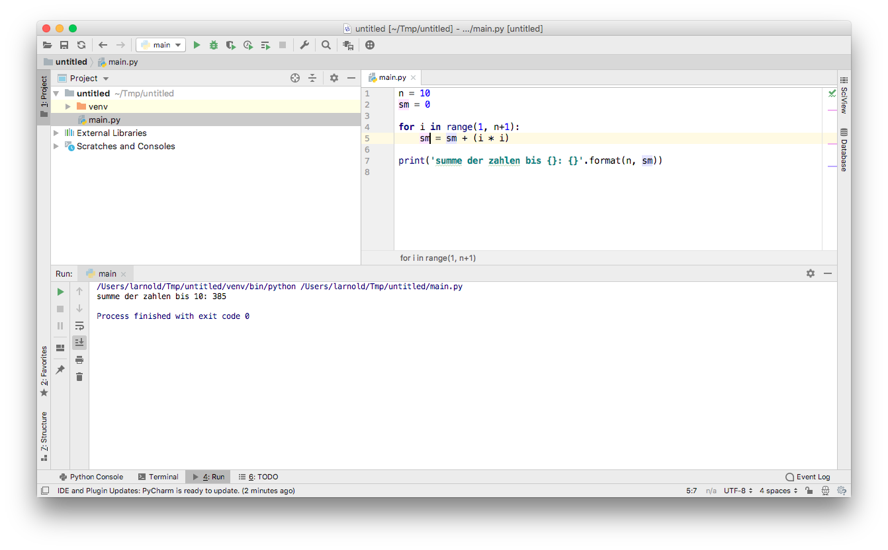
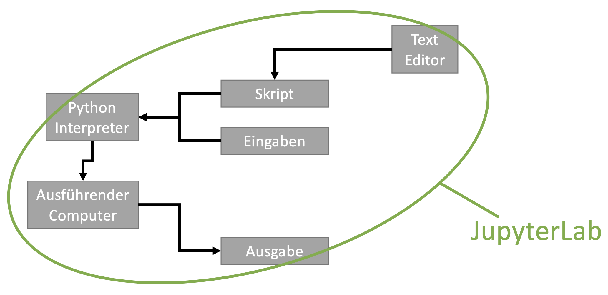
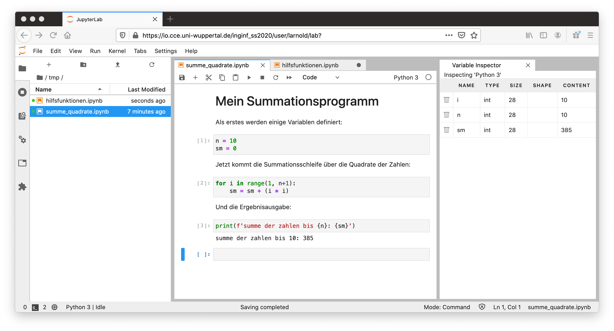

<!---
<h1>Ingenieurinformatik</h1>

<h2>Vorlesung 1.0 – Übersicht Computer</h2>

Lukas Arnold   
Computational Civil Engineering  
Bergische Universtität Wuppertal
--->

---

class: topic

# Python

---

# Python

* Einstieg
* Generalität
* Erweitbarkeit
* Verfügbarkeit

---

# Interpretierte Sprache

* Interpreter

* kein klassisches Programm

* Portabilität

* Performance

---
# Texteditor und Interpreter

---
# Texteditor und Interpreter

---
# Integrierte Entwicklungsumgebung

---
# Integrierte Entwicklungsumgebung

---
# JupyterLab

---
# JupyterLab

---

# Zusammenfassung

* Computer sind Hardware und Software

* Betriebssysteme abstrahieren die Hardware

* Dateisysteme organisieren und speichern langfristig Daten
   